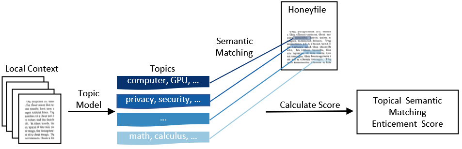

# TSM: Measuring the Enticement of Honeyfiles with Natural Language Processing

This is the official Pytorch code for the paper "TSM: Measuring the Enticement of Honeyfiles with Natural Language Processing", by Roelien C. Timmer, David Liebowitz, Surya Nepal and Salil S. Kanhere, accepted at Hawaii International Conference on System Sciences (HICSS) 2022. 

**Abstract**: 
Honeyfile deployment is a useful breach detection method in cyber deception that can also inform defenders about the intent and interests of intruders and malicious insiders. A key property of a honeyfile, enticement, is the extent to which the file can attract an intruder to interact with it. We introduce a novel metric, Topic Semantic Matching (TSM), which uses topic modelling to represent files in the repository and semantic matching in an embedding vector space to compare honeyfile text and topic words robustly. We also present a honeyfile corpus created with different Natural Language Processing (NLP) methods. Experiments show that TSM is effective in inter-corpus comparisons and is a promising tool to measure the enticement of honeyfiles. TSM is the first measure to use NLP techniques to quantify the enticement of honeyfile content that compares the essential topical content of local contexts to honeyfiles and is robust to paraphrasing.

TSM enticement score visualisation:




## Code requirements

We used Python 3.5.6 and the required packages are listed in `requirements.txt`

Run the following script subsequently:

```bash
python src/preprocess_files.py
python src/categorise_local_context_files.py
python src/get_topics.py
python src/tsm.py
```

To generate the plots of the paper, run the notebook `notebook/visualisations_tsm_paper.ipynb`

## Citation 

If you find our code useful, please cite our paper: 

```
@inProceedings{timmer2022tsm,
  title={TSM: Measuring the Enticement of Honeyfiles with Natural Language Processing},
  author={Timmer, Roelien and Liebowitz, David and Nepal, Surya and Kanhere, Salil},
  booktitle={Proceedings of the 55th Hawaii International Conference on System Sciences (HICSS)},
  year={2022}
}
```
